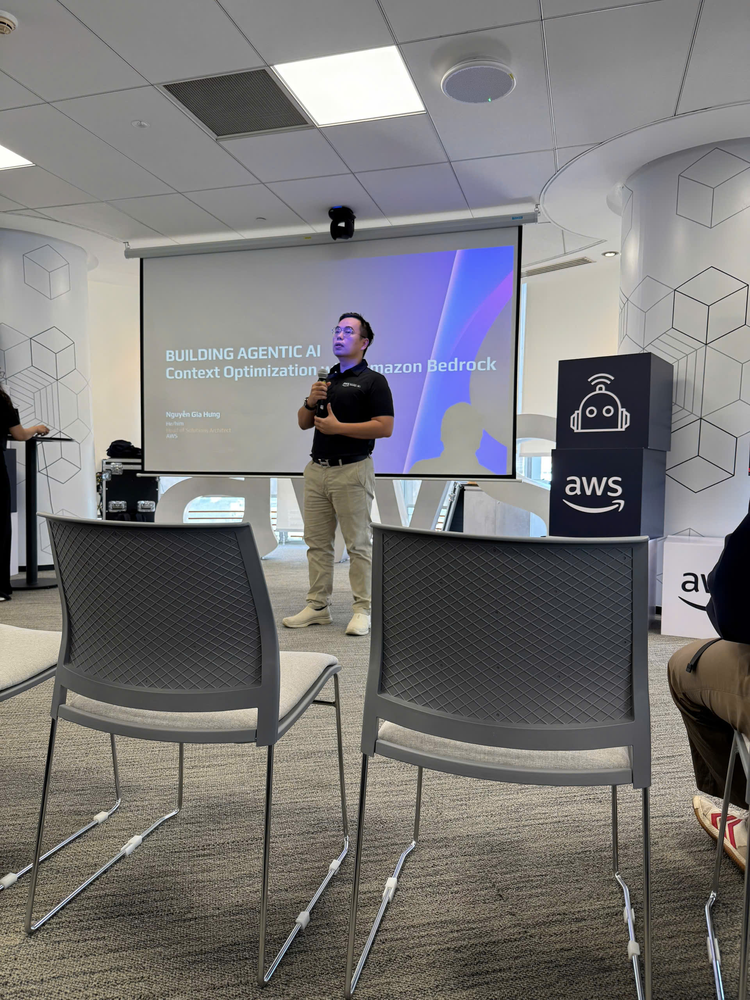

---
title: "Event 4"
date: 2025-09-10
weight: 1
chapter: false
pre: " <b> 4.4. </b> "
---

- Founder của Diaflow - giải pháp AI workflow

#### Kha Van
**Community Leader**, AWS

- AWS Community Leader
- Chuyên gia về hands-on training và workshops
- Mentor cho AWS community

#### Thang Ton
**Co-Founder & COO**, CloudThinker

- Co-founder của CloudThinker
- Chuyên gia về cloud orchestration và automation
- Expert về agentic orchestration platforms

#### Henry Bui
**Head of Engineering**, CloudThinker

- Chuyên gia về agentic orchestration
- Kinh nghiệm trong việc tối ưu hóa context và performance
- Expert về L300 technical deep-dive sessions

### Nội Dung Nổi Bật

#### Building Agentic AI

**Giới thiệu Agentic AI:**

- Agentic AI là gì và tại sao quan trọng
- Autonomous AI agents vs traditional AI
- Use cases và applications
- Future of AI với agentic systems

**Context Optimization:**

- Tại sao context optimization quan trọng
- Techniques để optimize context
- Cost reduction strategies
- Performance improvement
- Best practices

#### AWS Bedrock Agent Core

**Kiến trúc Bedrock Agent:**

- **Agent**: Entity chính thực hiện các tác vụ
- **Knowledge Base**: Nguồn thông tin cho agent
- **Action Groups**: Các hành động agent có thể thực hiện
- **Orchestration**: Quản lý flow và context
- **Context Management**: Tối ưu hóa context

**Tính năng chính:**

- Natural language understanding
- Context management và optimization
- Multi-step reasoning
- Integration với AWS services
- Custom actions và workflows

#### Agentic Workflow Use Case

**Building Agentic Workflow:**

- Thiết kế workflow phức tạp với nhiều agents
- Orchestration và coordination giữa các agents
- Context optimization trong workflows
- Error handling và retry logic
- Monitoring và observability

**Best Practices:**

- Design patterns cho agentic workflows
- Context management strategies
- Performance optimization
- Cost optimization
- Security và compliance

#### CloudThinker Agentic Orchestration

**Agentic Orchestration Patterns:**

- Sequential workflows
- Parallel execution
- Conditional branching
- Error recovery và fallback
- Context sharing giữa agents

**Context Optimization Techniques:**

- Context compression và summarization
- Relevant information extraction
- Memory management
- Cost optimization strategies
- Performance tuning

**Integration với Amazon Bedrock:**

- Seamless integration với Bedrock models
- Custom model selection
- Prompt engineering và optimization
- Response formatting và validation
- Context optimization APIs

### Những Gì Học Được

#### Hiểu về Building Agentic AI

- **Agentic AI là gì**: Autonomous AI agents có khả năng thực hiện tasks độc lập
- **Context Optimization**: Techniques để optimize context và giảm costs
- **Use cases**: Các trường hợp sử dụng thực tế cho agentic AI
- **Architecture**: Kiến trúc và design patterns

#### AWS Bedrock Agent

- **Bedrock Agent Core**: Hiểu cách agent hoạt động và tương tác
- **Context Management**: Quản lý và optimize context
- **Integration**: Cách tích hợp với các AWS services khác
- **Best Practices**: Best practices từ AWS experts

#### Agentic Workflow Design

- **Workflow patterns**: Các pattern phổ biến cho agentic workflows
- **Orchestration**: Cách quản lý và điều phối nhiều agents
- **Context Optimization**: Strategies cho context optimization
- **Error handling**: Strategies cho xử lý lỗi và recovery

#### CloudThinker Platform

- **Agentic orchestration**: Cách CloudThinker giải quyết orchestration challenges
- **Context optimization**: Advanced techniques để optimize context
- **Platform capabilities**: Các tính năng và khả năng của CloudThinker
- **Integration patterns**: Cách tích hợp CloudThinker vào existing systems

#### Hands-on Experience

- **Practical skills**: Kỹ năng thực tế trong việc xây dựng Bedrock Agents
- **Context optimization**: Thực hành context optimization techniques
- **Troubleshooting**: Cách debug và troubleshoot common issues
- **Real-world scenarios**: Làm việc với các scenarios thực tế

### Ứng Dụng Vào Công Việc

- **Xây dựng Agentic AI**: Sử dụng AWS Bedrock Agent để xây dựng autonomous AI agents
- **Context Optimization**: Áp dụng context optimization techniques để giảm costs và improve performance
- **Thiết kế Workflows**: Áp dụng agentic workflow patterns vào các dự án
- **Tích hợp CloudThinker**: Đánh giá và tích hợp CloudThinker vào existing solutions
- **Best Practices**: Áp dụng best practices từ workshop vào production systems

### Trải nghiệm trong event

Tham gia workshop **"Building Agentic AI: Context Optimization with Amazon Bedrock"** là một trải nghiệm học tập chuyên sâu về agentic AI và context optimization. Sự kiện cung cấp cả kiến thức lý thuyết và hands-on practice, giúp em hiểu rõ về cách xây dựng và tối ưu hóa autonomous AI agents.

#### Opening và giới thiệu

- **Opening session** của Nguyen Gia Hung tạo không khí chuyên nghiệp và inspiring.
- Em hiểu về tầm quan trọng của Building Agentic AI và Context Optimization.
- **Overview** về event agenda giúp em hình dung rõ hành trình học tập.

#### AWS Bedrock Agent Core

- **Session của Kien Nguyen** cung cấp foundation vững chắc về Bedrock Agent.
- Em học về kiến trúc, components, và cách thức hoạt động của Bedrock Agent.
- **Context management** là điểm nhấn quan trọng trong session này.
- **Demo tạo Bedrock Agent** cho thấy quy trình thực tế từ đầu đến cuối.

#### Use Case thực tế

- **Use case presentation** của Viet Pham minh họa cách agentic workflows được sử dụng trong production.
- Học về challenges thực tế và cách giải quyết chúng.
- **Context optimization trong production** rất practical và insightful.
- **Demo agentic workflow** cho thấy performance và capabilities trong thực tế.

#### CloudThinker Platform

- **CloudThinker introduction** của Thang Ton giới thiệu về platform và giải pháp.
- **L300 session** của Henry Bui đi sâu vào technical details và advanced patterns.
- Học về context optimization techniques nâng cao để improve performance và reduce costs.
- **Demo CloudThinker platform** cho thấy capabilities và ease of use.

#### Hands-on Workshop

- **Hands-on workshop** của Kha Van cung cấp cơ hội thực hành trực tiếp.
- Xây dựng Bedrock Agent từ đầu với guidance từ expert.
- Thực hành context optimization và agentic orchestration.
- **Troubleshooting session** giúp em hiểu cách giải quyết common issues.
- **Q&A trực tiếp** cung cấp answers cho specific questions.

#### Networking và kết nối

- **Networking sessions** cho phép kết nối với các AWS experts và AI practitioners.
- Chia sẻ experiences và learnings với other participants.
- **Lunch buffet** tạo cơ hội cho informal discussions và connections.
- Gặp gỡ các chuyên gia và nhận advice về career development.

#### Bài học rút ra

- **Agentic AI là tương lai**: Autonomous AI agents sẽ thay đổi cách chúng ta xây dựng AI applications.
- **Context Optimization là key**: Optimizing context có thể significantly reduce costs và improve performance.
- **Hands-on practice is essential**: Practical experience là crucial để truly understand và apply concepts.
- **Platform solutions matter**: CloudThinker và các platforms tương tự simplify việc xây dựng agentic systems.
- **Community is valuable**: Networking với experts và practitioners cung cấp valuable insights và opportunities.

#### Một số hình ảnh khi tham gia sự kiện

