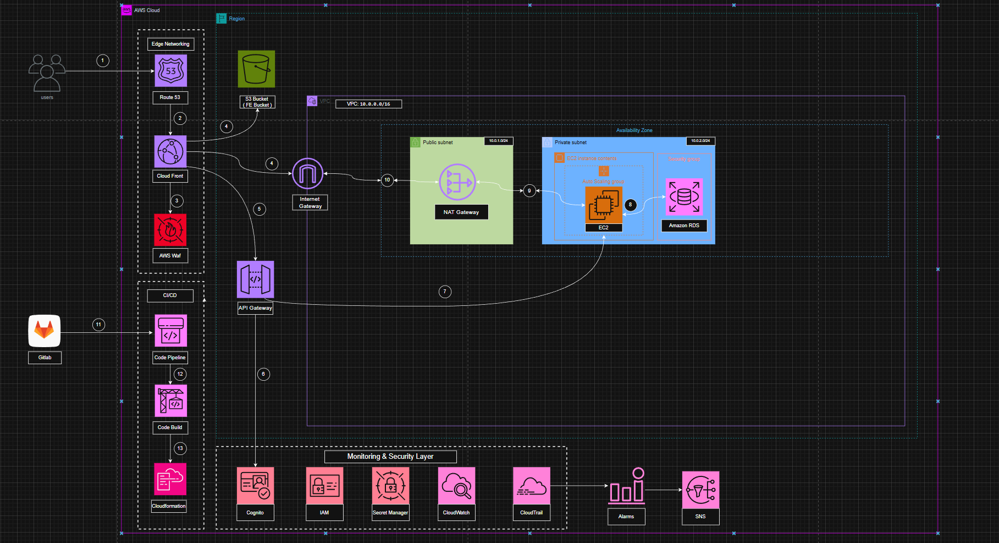

#### Tổng Quan Dự Án Workshop AWS

Workshop này hướng dẫn cách triển khai một **ứng dụng web full-stack hoàn chỉnh** trên AWS sử dụng **Infrastructure as Code (CloudFormation)**. Ứng dụng bao gồm:

- **Backend**: Spring Boot REST API chạy trên các EC2 instances trong private subnets
- **Frontend**: Ứng dụng React được phục vụ qua CloudFront từ S3
- **Database**: MySQL RDS instance để lưu trữ dữ liệu
- **API Gateway**: RESTful API Gateway cho giao tiếp frontend-backend
- **Load Balancer**: Application Load Balancer cho tính sẵn sàng cao

#### Các Thành Phần Kiến Trúc

- **VPC**: VPC tùy chỉnh với public và private subnets trên 2 Availability Zones
- **EC2 Auto Scaling Group**: Máy chủ ứng dụng backend với khả năng auto-scaling
- **RDS MySQL**: Dịch vụ database được quản lý cho dữ liệu ứng dụng
- **S3 Buckets**: Static hosting cho frontend và lưu trữ artifacts cho backend
- **CloudFront**: CDN cho phân phối nội dung toàn cầu
- **API Gateway**: RESTful API endpoint với hỗ trợ CORS
- **VPC Endpoints**: Kết nối riêng tư đến các dịch vụ AWS (S3 Gateway, SSM, SSM Messages, EC2 Messages, CloudWatch Logs)
- **Systems Manager**: Truy cập an toàn vào EC2 instances mà không cần SSH keys

#### Tính Năng Chính

- **Infrastructure as Code**: Toàn bộ hạ tầng được định nghĩa trong CloudFormation
- **High Availability**: Triển khai Multi-AZ với Auto Scaling
- **Bảo Mật**: Private subnets, security groups, IAM roles, VPC endpoints
- **Giám Sát**: CloudWatch logs, alarms, và metrics
- **Tối Ưu Chi Phí**: VPC endpoints để giảm chi phí data transfer của NAT Gateway
- **Khả Năng Mở Rộng**: Auto Scaling dựa trên CPU metrics

