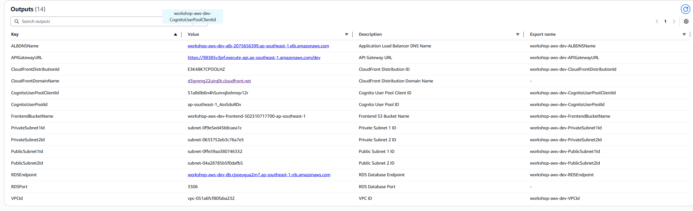

#### Yêu Cầu Trước

Trước khi build và triển khai frontend, đảm bảo bạn có:

- **Node.js** và **npm** đã cài đặt (Node.js 18+ được khuyến nghị)
- **AWS CLI** đã cấu hình với credentials phù hợp
- **Tên frontend bucket** từ CloudFormation outputs
- **CloudFront Distribution ID** từ CloudFormation outputs

#### Lấy Thông Tin Cần Thiết

1. Lấy tên frontend S3 bucket:

```bash
aws cloudformation describe-stacks \
  --stack-name workshop-aws-dev \
  --region ap-southeast-1 \
  --query "Stacks[0].Outputs[?OutputKey=='FrontendBucketName'].OutputValue" \
  --output text
```

2. Lấy CloudFront Distribution ID:

```bash
aws cloudformation describe-stacks \
  --stack-name workshop-aws-dev \
  --region ap-southeast-1 \
  --query "Stacks[0].Outputs[?OutputKey=='CloudFrontDistributionId'].OutputValue" \
  --output text
```

3. Lấy API Gateway URL:

```bash
aws cloudformation describe-stacks \
  --stack-name workshop-aws-dev \
  --region ap-southeast-1 \
  --query "Stacks[0].Outputs[?OutputKey=='APIGatewayURL'].OutputValue" \
  --output text
```

#### Xác Minh Biến Môi Trường Frontend

Kiểm tra file `.env` trong thư mục `FE` chứa API URL đúng:

```bash
# Windows
type FE\.env

# Linux/Mac
cat FE/.env
```

File nên chứa:

```env
VITE_API_URL=https://98385v3jef.execute-api.ap-southeast-1.amazonaws.com/dev/dna_service
VITE_COGNITO_USER_POOL_ID=ap-southeast-1_4osSduRDx
VITE_COGNITO_CLIENT_ID=51alb0b6n4h5unrojbshmqv12r
VITE_COGNITO_REGION=ap-southeast-1
```

**Lưu ý:** Cập nhật `VITE_API_URL` với API Gateway URL thực tế từ bước 3 ở trên nếu khác.

